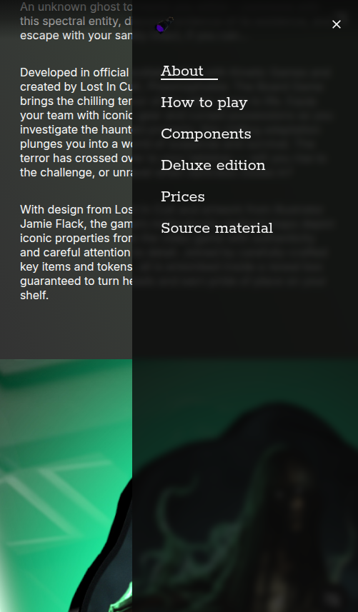
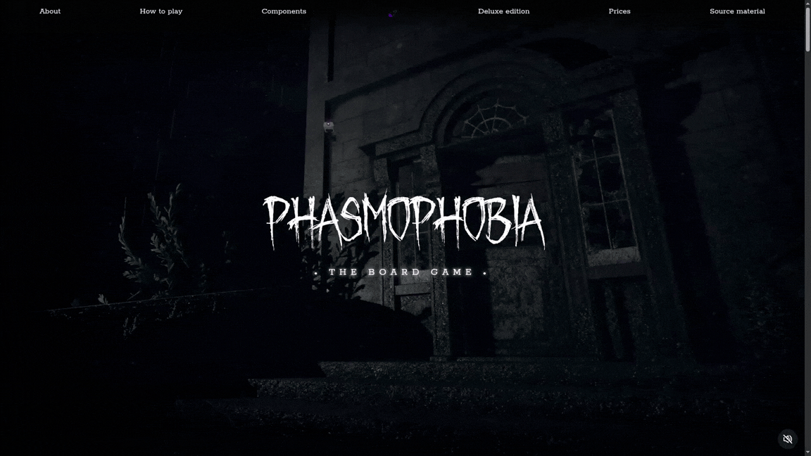
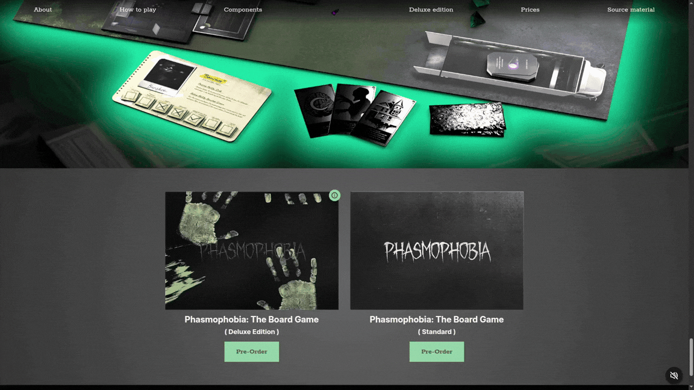

# Phasmophobia Board Game Themed Web Project

This project was created as part of a Web Development Tools course. The goal was to design and implement a responsive, interactive website built around a board game theme, while applying modern frontend development practices such as SCSS architecture and design tokens.

## Project Overview

The website presents a board game themed experience with multiple interactive and visual elements. Beyond static layout design, the project focuses on styling scalability, theming, and subtle user interactions to enhance immersion.

Key focus areas include:

- SCSS-based styling architecture
- Two-level design token system
- Theme switching (including UV/“blacklight” mode)
- Interactive UI effects and sound feedback

## Design System

The project uses a structured **design token system** with two levels:

### 1. Reference Tokens

Define base values such as:

- Colors
- Typography scales
- Spacing system
- Shadows
- Border radius

### 2. Component Tokens

Map reference tokens into component-specific roles such as:

- Background / surface colors
- Text hierarchy
- Interactive states (hover, active, disabled)
- Theme-specific overrides (light / UV theme)

This separation allows consistent styling while keeping the system flexible and maintainable.

## Interactive Features

### Scroll Sound Effects

Subtle sound effects are triggered during scrolling interactions, enhancing feedback and making navigation more tactile.

### UV Theme Toggle

A special “UV lamp” interaction enables a secondary visual theme that changes the overall appearance of the site. This mode simulates a stylized ultraviolet lighting effect, significantly altering colors and atmosphere.

## Technologies Used

- HTML5
- SCSS (modular architecture)
- JavaScript (DOM interaction & UI logic)
- Design tokens (custom implementation)
- CSS transitions & animations
- Audio (scroll feedback)

## Getting Started

Its hosted on GitHub Pages: https://tothbence0531.github.io/phasmophobia-board-game/

To run the project locally:

1. Clone the repository
2. Compile SCSS to CSS
3. Open `index.html` in a browser

## Learning Outcomes

This project demonstrates:

- Practical SCSS architecture design
- Scalable design token systems
- Theme switching implementation
- UI interaction design with sound feedback
- Structuring a medium-scale frontend project

## Notes

The project was built in a week as a learning exercise and focuses on frontend architecture and design systems rather than backend functionality.
